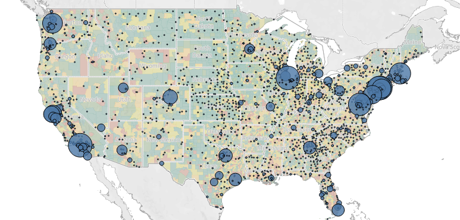
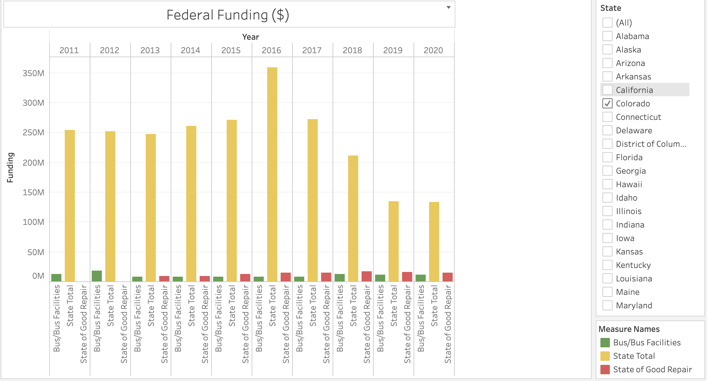
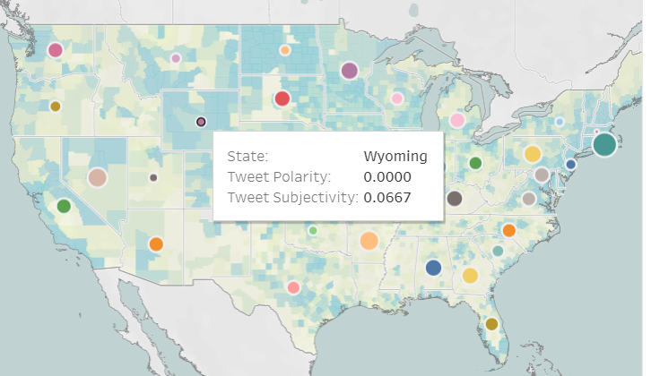

# The Transit Hub

## Project Description
Public transit is an integral part of the landscape of an organized society. A well-developed and well-patronized public transit system provides connectivity to schooling, jobs, and other essential services. These services are especially useful for a citizenry without the financial resources to sustain the cost of ownership of a private vehicle. A robust and sustainable public transit system is also a pivotal force in combating carbon emissions as nations come to terms in the global effort in addressing climate change. 

According to the American Public Transportation Association, Americans took 9.9 billion trips on public transit in 2019, which drives home the core importance of public transit in the US and the extent to which Americans rely on this public service.

Public transit is also a matter that is regularly on local and state level ballots to increase or decrease funding, and is one of a few government-funded services that receives lip service support on both sides of the political aisle. However, information on public transit stops, funding, and ridership is scattered at best. Various stakeholders rely on this data to further their goals. Lawmakers amend policy and funding in order to address the needs of their constituents. Advocacy groups use this data in order to amend their requests and strategy. Local businesses use transportation options in their benefits packages when attracting new talent. 

Our tool, The Transit Hub, offers a comprehensive, interactive picture of the public transit landscape across the United States.

## Data Sources 
We used the following data sources in compiling information for The Transit Hub. 

* We used a dataset [marking bus stops from the US Department of Transportation](https://data-usdot.opendata.arcgis.com/datasets/gtfs-ntm-stops) to find the location of as many bus stops as was available. 
* We used the [Homeland Infrastructure Foundation-Level Data](https://hifld-geoplatform.opendata.arcgis.com/datasets/public-transit-stations) to find the location of as many rail stations as was available. 
* We used another dataset from [the US Department of Transportation](https://www.transit.dot.gov/ntd/data-product/monthly-module-raw-data-release) to find funding data from various sources across the US for 2019. 
* We used another dataset from [the US Department of Transportation](https://www.transit.dot.gov/ntd/data-product/2019-time-series) to extract time series data on transit funding at a national level for the past 20 years. 
* We used [Twitter's API](https://developer.twitter.com/en/docs) to scrape tweets about public transit from as many states as was available, and then analyze them using Natural Language Processing. 

## Process
Given that The Transit Hub is meant to provide a comprehensive picture of the state of public transportation in the United States, we took a map-based approach to visualizing our data. 

In the extraction and cleaning process, we used Pandas and Matplotlib to perform cleaning and exploratory data analysis, all of which can be seen in our Jupyter Notebooks, especially for the Natural Language Processing portion of this project. 

For visualizing location-based data, we used Tableau, primarily for its ease of use, aesthetically pleasing, and user-friendly maps. Given the volume of our data, we decided to represent funding, transit accessibility, and sentiment analysis data on separate maps in order to maintain an ease of interpretability and to separate maps thematically in our final product, on different pages of our final website. 

For analysis of twitter data (sentiment analysis), we used the Natural Language Toolkit (NLTK) to perform sentiment analysis on 200 tweets from 35 states (which was all available data from Twitter’s API with these specifications), and on 100 tweets at the national level (which was all available data from Twitter’s API with those specifications). 

In constructing the linear regression model, we used scikit-learn as well as some feature engineering to construct the two lag columns (previous year’s ridership and ridership from two years ago) to use as features in addition to urban transit funding to predict ridership levels. Initially, we used a linear regression model to discern whether polarity and subjectivity data from the Natural Language Processing portion could predict income from fares in a given state, however that model lacked enough features based on our available data to construct a model of any utility. 

Our final product is hosted on Heroku and uses a combination of HTML, CSS, and Bootstrap to organize and present our analysis in a user-friendly way. 

## Content Overview

This screenshot shows the contiguous 48-states portion of the transit accessibility section of The Transit Hub. The background coloring of the map is the population density of each county. Red dots represent available data on rail stop locations, and blue dots represent available data on bus stop locations. 

This screenshot shows the contiguous 48-states portion of the funding by source section of the Transit Hub. The background coloring of the map shows the population density of each county. Larger dots represent a higher total funding amount from the given source. 

This screenshot shows the accuracy of our machine learning linear regression model using urban transit funding, previous year's ridership, and ridership from two years ago as features predicting the current year's ridership within approximately 500,000 riders, giving the model an error rate of around 5% 

This screenshot shows the most commonly occurring words in tweets about public transit that were tweeted from the United States and scraped from twitter's API for the purposes of sentiment analysis. 

This screenshot shows the distribution of federal funding for the past 9 years to each state, including the state total of federal funding received and funding meant for buses and funding for rail repair (state of good repair).

This screenshot shows the polarity (positive/neg opinion) and subjectivity (opinion vs fact) of tweets about public transportation in different states. Larger dots indicate more positive sentiment about public transit, and vice versa. 

## Project Contributors 

* [Jay Spears](https://github.com/spearjen) handled front-end construction (HTML/CSS/Bootstrap) and assembly of all components into the final website, constructed the funding visualization map on top of a population density map of the United States as well as finding data sources to use for other components of the project. 

* [Ryan Eberle](https://github.com/Ryan-Eberle) handled time-series funding data visualization, contributed to graph descriptions and website copy, as well as finding data sources to use for other components of the project. 

* [Nathaniel Diamond](https://github.com/DiamondN97) handled visualizing transit accessibility data onto a population density map of the United States, as well as finding data sources to use for other components of the project. 

* [Faith Lierheimer](https://github.com/faithlierheimer) handled accessing Twitter's API to extract text data for natural language processing, and built the machine learning linear regression model, as well as finding data sources to use for other components of the project. 
